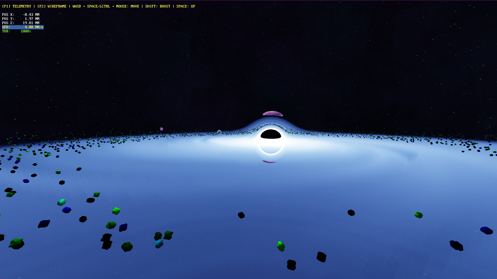

```
.      *             .       .           *      .        .       .   *   
   .        .        .      *        .       .       .       .        .
        *        .      S T E L L A R - A G E N T S   .          *             
    .       .     .                             .       .     .       .    
   *   .      .        .      *        .       .   *     *   .      .      
                  ALPHA RELEASE

An AI sandbox for adaptive agents moving through relativistic spacetime
conditions around a black hole. 

Core Engineer: Mika Rattay
Project Classification: AI Open-World Simulation Sandbox
Standard Specification: ISO/IEC C++20 Language Compliant Pipeline
```
WORK IN PROGRESS 

# Stellar Agents: High-Performance Relativistic Simulation Sandbox

> **A bare-metal C++20 / bgfx research sandbox engineered to benchmark high-density Complex Adaptive Dynamical Systems (CADS) under extreme gravitational and relativistic stress.**

---

## 🚀 Architectural Overview

`stellar-agents` is built to solve a core problem in modern engine development: scaling millions of concurrent agent states without hitting memory bottlenecks, cache thrashing, or pointer-chasing overhead. 

By completely bypassing traditional Object-Oriented Programming (OOP) and virtual table bloat, this framework enforces strict **Data-Oriented Design (DoD)** principles to saturate CPU L1/L2 caches and stream raw data straight into the GPU pipeline.

### Core Technical Pillars

* **Pure Data-Oriented Design (DoD):** All entity states (`AgentState`) are stored in contiguous, layout-stable, flat memory records optimized for 64-byte L1 cache-line alignment, validated at compile-time via C++20 Concepts.
* **Block-Free Multithreading:** Utilizes modern C++20 `std::jthread` worker pools with cooperative stop-tokens. Data isolation is maintained via double-buffering matrices (`EnvironmentMatrix`) coupled with atomic pointer `std::swap` operations at the frame barrier to completely eliminate mutex stalls.
* **GPU-Accelerated Graphics Pipeline:** The main thread executes zero coordinate transformations, acting as a stateless consumer that bulk-streams raw Euclidean data points directly into VRAM via `bgfx`.
* **Relativistic Shaders:** Features custom GLSL pipelines, including a volumetric raymarching fragment shader for accretion disks (`accretion.frag`) and a vertex-shader optical transformation handling screen-space Einstein gravitational lensing (`lensing.vert`).

---

## 📊 Performance Benchmark Profile

* **Active Entities:** 2,500,000 concurrent particles/vessels.
* **Environment:** Orbital mechanics around a central Kerr/Schwarzschild black hole barycenter.
* **Hardware Target:** Multi-core x86-64 consumer silicon (optimized via `/arch:AVX2 /fp:fast`).
* **Frame Rate:** Stable real-time execution bounds.

---

## 🛠️ Tech Stack & Build System

* **Language Standard:** ISO/IEC C++20
* **Graphics API Abstraction:** `bgfx` / `shaderc`
* **Build System:** Cross-platform CMake pipeline
* **License:** MIT
```
stellar-agents/
├── src/                                
│   ├── main.cpp                        # Application entry point and primary process lifecycle orchestration.
│   │
│   ├── cads/                           # Complex Adaptive Dynamical Systems (Behavior & State Logic)
│   │   ├── adaptive_agent.cpp          # Autonomous decision heuristics and trajectory evaluation.
│   │   ├── agent_state.h               # State machine definitions for high-frequency behavioral switching.
│   │   ├── attractor_agent.cpp         # Gravitational/magnetic target acquisition and homing kinematics.
│   │   ├── environment_matrix.cpp/.h   # Spatial partitioning structures for localized environmental querying.
│   │   └── passive_agent.cpp           # Low-overhead kinematic updates for non-reactive particulate entities.
│   │
│   ├── engine/                         # Core Execution, Physics, and Rendering Systems
│   │   ├── engine_config.h             # Compile-time constants and hardware capability bounds.
│   │   ├── engine_context.h            # Global application state and cross-system memory pointers.
│   │   ├── geometric_primitives.cpp/.h # Procedural topological generation for collision and render meshes.
│   │   ├── kinematics_system.cpp/.h    # Deterministic integration of velocity, acceleration, and drag vectors.
│   │   ├── physics_evolution.cpp/.h    # Global numerical solvers for entity translation over delta-time.
│   │   ├── render_core.cpp/.h          # Graphics API abstraction and hardware command buffer submission.
│   │   ├── telemetry_hud.cpp/.h        # Real-time performance profiling and statistical overlay rendering.
│   │   ├── universe_seeder.cpp/.h      # Procedural initialization of the initial SoA memory payloads.
│   │   └── window_manager.cpp/.h       # OS-level window context, input polling, and swapchain management.
│   │
│   ├── ext/                            # External dependencies (bgfx, bimg, bx, glfw).
│   │
│   ├── math/                           # Core Mathematics & Physics Formulations
│   │   └── relativity.cpp/.h           # Non-euclidean space-time metrics and gravitational lensing equations.
│   │
│   └── shaders/                        # GPU Rendering Pipeline & Compute Programs
│       ├── accretion.frag              # Volumetric raymarching, Doppler beaming, and procedural noise evaluation.
│       ├── instancing_frag.sc          # Lambertian reflectance and photometric shading for mass-instanced agents.
│       ├── instancing_vert.sc          # High-throughput vertex displacement and clip-space relativistic optical bending.
│       ├── instancing.varying.def.sc   # Interpolation variable declarations for the instancing pipeline.
│       ├── lensing.vert                # Legacy per-vertex 3D spatial deformation (Scientific computing reference).
│       └── varying.def.sc              # Standard interpolation variable declarations for base rendering passes.
```
# Stellar Agents: High-Density Kinematic AI & Rendering Framework

## Overview
**Stellar Agents** is a custom C++20 engine framework engineered from the ground up to demonstrate high-performance Data-Oriented Design (DOD). The primary objective of this architecture is to support massive-scale Artificial Intelligence simulations (up to 2.5 million concurrent entities) alongside a physically-based relativistic rendering pipeline.

This project eschews traditional Object-Oriented Programming (OOP) paradigms in favor of a strict **Structure of Arrays (SoA)** memory layout, ensuring maximum cache coherency for CPU-bound AI logic (such as spatial partitioning and swarm kinematics) while directly interfacing with hardware-instanced GPU buffers.

## Core Systems Architecture

### 1. Data-Oriented Entity Management (AI-Ready)
* **SoA Memory Layout:** Entity spatial data (position, rotation, velocity, scale) and material identifiers are stored in contiguous memory arrays to minimize L1/L2 cache misses during high-frequency updates.
* **Zero-Copy GPU Upload:** C++ SoA buffers align with graphics API instance data layouts, enabling O(1) memory mapping directly to VRAM.
* **Scalability:** Capable of maintaining rigid 60+ FPS bounds while processing kinematics for 2,500,000 independent agents on modern multi-core architectures.

### 2. Relativistic Graphics Pipeline (Vulkan / bgfx)
* **Volumetric Raymarching:** Custom screen-space raymarching fragment shader evaluating non-euclidean light paths around a simulated gravitational singularity (Black Hole), including an accretion disk, Doppler beaming, and a procedural deep-space skybox.
* **Screen-Space Gravitational Lensing (Instancing Hack):** A high-performance optical illusion implemented in the vertex shader. Instead of deforming individual vertices of 2.5 million meshes (which causes geometric tearing), the shader computes a 2D apparent-position shift in clip-space based on the instance's center of mass, achieving relativistic optical bending with near-zero frame time cost.
## Technology Stack
*   **Language:** ISO C++20
*   **Graphics API Abstractor:** bgfx (Targeting Vulkan/DirectX12)
*   **Shader Language:** BGFX-flavored GLSL/HLSL

## Future Roadmap (AI Integration)
The current framework establishes the foundational constraints for mass-entity rendering. Upcoming iterations will introduce:
1.  **Dynamic Spatial Partitioning (Octree / Grid Hash):** $O(\log n)$ neighbor-search algorithms for collision avoidance.
2.  **Autonomous Kinematics:** Implementation of separation, alignment, and cohesion vectors for emergent swarm behavior.
3.  **Get DirectX12 to work with bgfx**: Integrate DirectX12 backend for Windows-specific optimizations.

### System Status & Technical Architecture

#### 🟢 [PROTOTYPE STATUS: COMPLIANT & LIVE]
* **Low-Level DoD Infrastructure & Zero-Heap Execution:** 
  Strict zero-allocation runtime pipeline. Memory is packed in cache-aligned flat arrays to maximize L1/L2 cache efficiency, allowing **2,500,000** active simulation entities to stream effortlessly without object-oriented pointer-chasing overhead.
* **Vulkan Graphics Backend:** 
  Fully integrated and live hardware-accelerated pipeline providing low-overhead command buffer submissions and direct VRAM memory mapping.
* **Relativistic Shader Suite:** 
  Complete and optimized GLSL shader pipeline featuring volumetric raymarching for accretion disks, Doppler beaming, and screen-space vertex transformations for relativistic optical lensing.

#### 🟡 [PRODUCTION ROADMAP: CONCEPT & ARCHITECTURE PLANNED]
* **Spatial Partitioning & Environment Matrix:** 
  Advanced grid-based spatial partitioning architectures for localized neighborhood querying and non-linear environment feedback routing at scale.

============================================================================
Domain: Physics Evolution Loop / Agent Deallocation Thresholds
============================================================================

1. THE EVENT HORIZON (KILL TRIGGER)
   - Physics: Absolute mathematical boundary where escape velocity = c.
   - Scale: Schwarzschild Radius (Rs) = ~44.3 km [0.0443 MM].

2. THE ISCO (STABILITY TERMINATOR)
   - Physics: Innermost Stable Circular Orbit. Absolute limit for circular paths.
   - Scale: Exactly 3x Schwarzschild Radius (3 * Rs) = ~132.9 km [0.1329 MM].

3. ARCHITECTURAL FLOW IMPLEMENTATION
   - Inside ISCO: Orbital dynamics collapse. Forces irreversible terminal spiral.
   - Core Loop: Ships remain fully rendered and processed through the plunge.
   - Deallocation Gate: Explicit destruction occurs only upon crossing Rs.

============================================================================
PROJECT: STELLAR-AGENTS — CORE REFERENCE PARADIGM: COORDINATE TOPOLOGY
============================================================================

1. SIMULATION CHALLENGES AND SOLUTIONS
   - Real-world astronomical coordinates measured in meters or kilometers 
     result in massive scalar fields (e.g., system boundaries exceed 
     60,000,000,000 meters).
   - While modern hardware consumer architectures natively support 64-bit 
     double precision operations, real-time rendering and graphics-pipeline 
     conventions predominantly optimize for 32-bit floating-point (IEEE 754 
     single precision) primitives to maximize data throughput and GPU cache 
     efficiency.
   - At high distances (e.g., >60,000), a 32-bit float's mantissa runs out 
     of precision bits, causing the minimum positional increment step to 
     degrade to ~4.0 kilometers. This triggers severe "Vertex Jittering," 
     breaking transformation matrices and clipping meshes.
   - THE ARCHITECTURAL SOLUTION: Large-scale real-time pipelines resolve this 
     scale fragmentation by decoupling space into global 64-bit coordinate zones 
     while rendering local meshes relative to the camera viewport using 32-bit 
     positions.

2. UNIT AND SCALING PARITY
   - DOMAIN COMPRESSION: To maximize SIMD execution throughput, eliminate pointer 
     indirection, and minimize the memory footprint, the hybrid 64-bit/32-bit 
     dual-precision layer is intentionally omitted in this specific sandbox 
     for absolute simplicity and raw performance.
   - SPATIAL VECTOR SCALING: The frame layout sets 1.0f Unit in C++ Code / GLSL 
     VRAM to equal exactly 1.0 Megameter (MM), where 1 MM = 1,000 Kilometers = 
     1,000,000 Meters. This maps the massive cosmic expanse into a cache-dense, 
     low-value numerical domain. Within our active perimeter (< 3,000f Units), 
     the hardware mantissa maintains a precise step delta of ~0.00012f Units, 
     ensuring a stable, jitter-free resolution down to ~120 meters.
   - GRAVITATIONAL MASS SCALING: Real-world solar masses (M_sol) are too small 
     in relative scalar value (e.g., Planet I = 0.000025 M_sol) to drive standard 
     32-bit float Newtonian kinematics without severe underflow and loss of 
     kinetic force. To bypass this, masses are mapped to simple runtime floats via 
     a compile-time scale constant (k_mass = 40.0f). The fixed barycenter mass 
     of 15.0 M_sol is scaled to 600.0f, which elevates the dynamic orbital 
     attraction vectors safely above the numerical floating-point noise floor.

3. INITIAL SIMULATION TOPOLOGY MATRIX (MASSES CALIBRATED IN M_SOL)
   - OBJECT 0 (BLACK HOLE): [0.0f, 0.0f, 0.0f] — Fixed Barycenter / Attractor (Mass: 15.0000 M_sol)
   - OBJECT 1 (PLANET I): [650.0f, 0.0f, 0.0f] — Active Orbital Core (Mass: 0.000025 M_sol)
   - OBJECT 2 (PLANET II): [-1414.2f, 0.0f, 1414.2f] — Active Orbital Giant (Mass: 0.000266 M_sol)
   - OBJECT 3 (GATEWAY): [1767.7f, 0.0f, -1767.7f] — Inertial Adaptive Spawner

AGENT CLASS          MAX CPU CAPACITY    MAX GPU CAPACITY     LIMITING HARDWARE FACTOR
----------------------------------------------------------------------------
attractor_agent      ~10 to 50           ~1,000+              None. Mathematically negligible; 
(Stars/Singularities)                                         purely deterministic spatial nodes.

passive_agent        ~15,000,000         ~250,000,000         CPU: RAM Bandwidth (Memory Bound).
(Asteroids/Debris)                                            GPU: VRAM Size & Thread Scheduler.

adaptive_agent       ~100,000            ~2,500,000           CPU: L1/L2 Cache Misses via Branches.
(Ships)                                                       GPU: Register Pressure & Divergence.

## ⚖️ Legal Disclaimer & Fair Use Notice

### 📡 Data and Lore Attribution
The source code contained within this repository is a completely independent, agnostic, custom Data-Oriented Design (DoD) simulation environment licensed under the open-source MIT terms. 

### 🛡️ Intellectual Property Notice
- This framework is a non-commercial, transformative, educational sandbox project developed under **Fair Use** principles solely for real-time high-performance computing (HPC) research and architectural demonstrations.